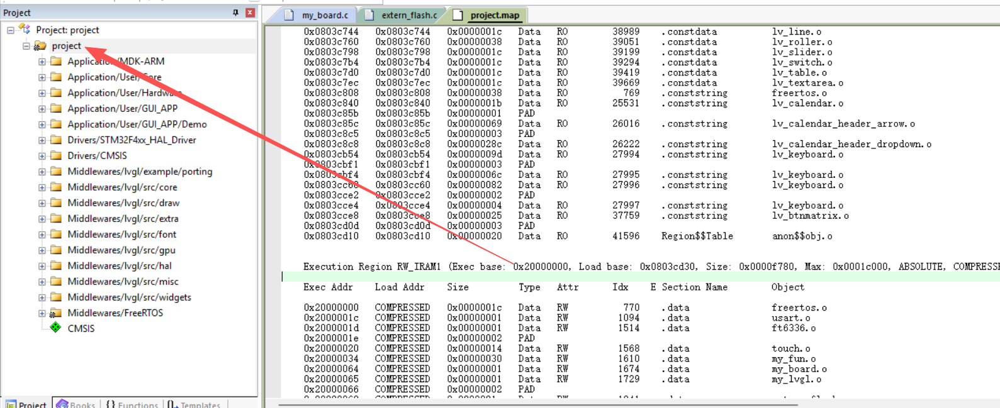

# 2025D_Freertos_LVGL

在STM32F407上移植好了LVGL图形库，LCD屏幕型号是MSP3526，想换其他屏幕可以自己修改LCD的驱动程序，项目工程为FreeRTOS版。使用SPI+DMA驱动屏幕。

这款LCD屏分辨率为320x480，尺寸为3.5寸，LCD驱动芯片为ST7796，接口为SPI，电容触摸屏驱动芯片为FT6336U，接口为IIC。

MCU超频后全屏刷新时帧率为9FPS左右，局部刷新时帧率为30+FPS。

项目参考了这位大佬：[zeruns/STM32F407_LVGL_Template_MSP3526: 基于STM32F407的LVGL工程模板（3.5寸ST7796触屏LCD），包含FreeRTOS版和裸机版，使用SPI+DMA驱动屏幕。](https://github.com/zeruns/STM32F407_LVGL_Template_MSP3526)

2026.3.21.19

**ADC_DMA_TIM** 参考：  [STM32HAL ADC+TIM+DMA采集交流信号 基于cubemx_tim+adc+dma-CSDN博客](https://blog.csdn.net/qq_34022877/article/details/121941236)

3.28：

使用可视化工具进行设计LVGL的界面，再把界面工程移植回STM32    

工具：1.[GUI Guider | NXP 半导体](https://www.nxp.com.cn/design/design-center/software/development-software/gui-guider:GUI-GUIDER) 

2. [最新发布 | anyui](https://anyui.tech/zh/release/release-latest.html)

推荐用第一个，资料多点

gui guider的一点教程：

[【快速入门 LVGL】-- 5、Gui Guider界面移植到STM32工程_gui guider stm32-CSDN博客](https://blog.csdn.net/qq_49053936/article/details/137834282)

3.29：

LVGL界面基本设置完成，与32通信基本完善。

DDS还没加进去。试了一下电阻分压测电阻值，不太准。

衰减，线长还没试。

4.11：

加进去了dds9834，可产生30MHz的正弦波。

加入了读取内部flash，碰到的问题：代码存在 Flash 里，擦除操作**把程序自己给删了**。第一次能跑是因为烧录后直接运行，复位后 CPU 找不到代码就死机了。解决办法：把测试地址改到 Flash **最后面的扇区**，离代码区远一点。

发现STM32F407VET6的内部flash只有512k，我的代码就占了349k，有六个片区，第六个片区占了256k，所以，要想在flash里面读写数据就得压缩程序，可是这样可能会阉割功能，所以放弃在内部flash里面读写数据。

4.12：

画了块板子，加了AT24C和W25Q,程序加进去了，还加了5933，但是都没测试。

4.16：

移植了eeprom即AT24C

5.2：

验证了AT24C和W25Q的代码，但是发现用AT24C的时候，flash读取时候出错，但是仍可读flash的id。以为是sram占用太多的问题，所以统一了lvgl的字体，都用了22号的统一字体，节省了大量的flash资源，然后减小了为lvgl分配的内存LV_MEM_SIZE，减少到16K，并修改了lv_demo_widgets.c中的#if LV_MEM_CUSTOM == 0 && LV_MEM_SIZE < (1ul * 1024ul)这一行代码，否则直接修改LV_MEM_SIZE会报错，减少了32K内存的使用，依然没能解决问题。

查看占用资源大小可以去.map看。进入.map直接搜Execution Region RW_IRAM1即可。

双击工程，一般可进入.map，如果不行的话可参考这篇博客[Keil5----打开map文件方法和map文件解析_.map文件怎么打开-CSDN博客](https://blog.csdn.net/MQ0522/article/details/126730765)
